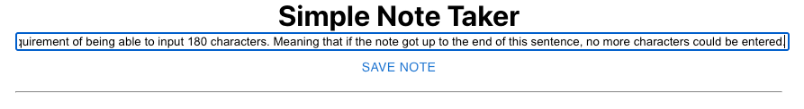
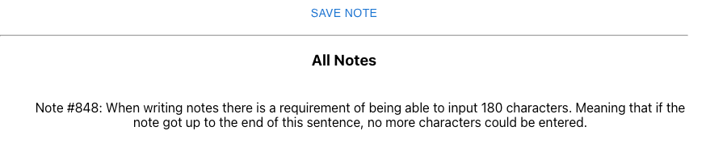
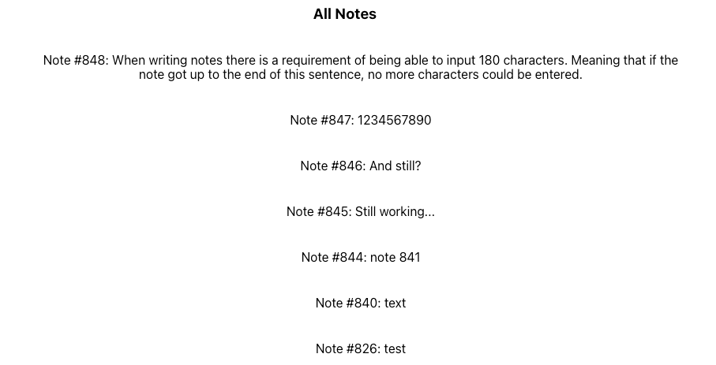
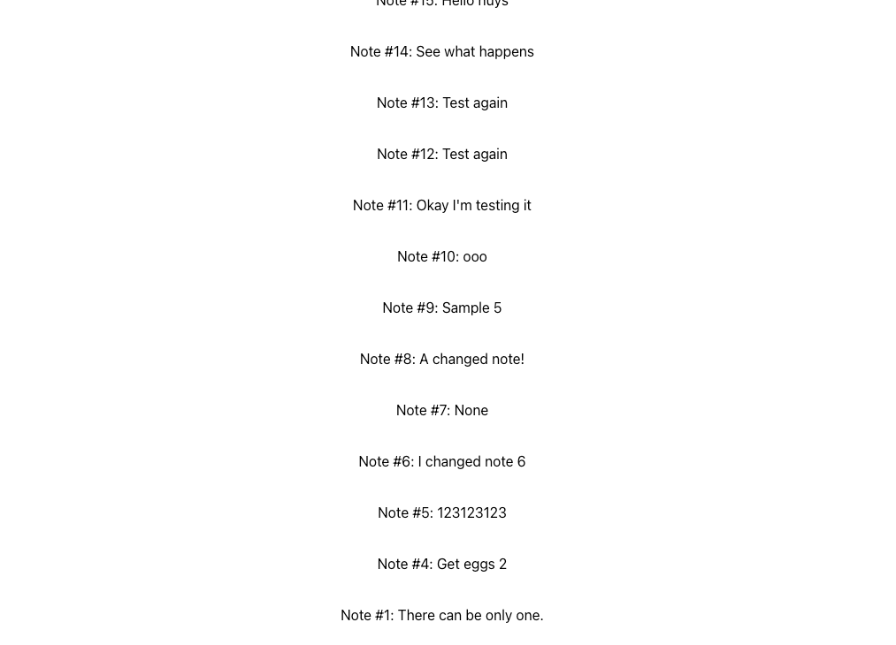

To run app:
```
$ git clone github.link
$ cd ./react-graphql-ts
$ yarn start
```
Then navigate to http://localhost:3000/

**Acceptance criteria:**

`1. As a user I want to write a note (max 180 characters)`

Test input: `When writing notes there is a requirement of being able to input 180 characters. Meaning that if the note got up to the end of this sentence, no more characters could be entered.`

`2. As a user I want to save a note to a remote database`


`3. As a user I want to view all previous notes saved to a remote database`

**...**
